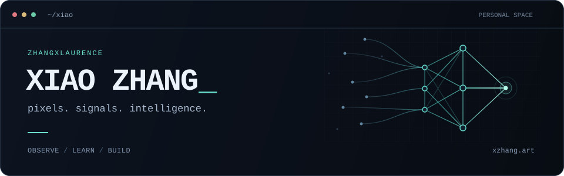

<a href="https://xzhang.art"></a>

<br>

**Pixels, movement, noisy data.** I build models that find structure in the mess.

I'm interested in how machines see, connect different signals, and learn by interacting with the world.

```text
$ cat interests.txt

vision        → learning useful representations
multimodal    → making different signals work together
embodied AI   → perception, action, repeat

$ under-the-hood
optimization · statistics · high-performance computing
```

<br>

**[xzhang.art ↗](https://xzhang.art)** &nbsp; / &nbsp; [say hello](mailto:xzhang11@seas.upenn.edu)
